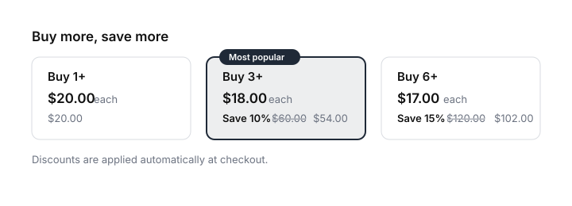

# Shopify Quantity Breaks

Volume pricing tiers ("buy 3, save 10%") on the product page of any Shopify Online Store 2.0 theme. Drop in a section, add your tiers in the theme editor, and shoppers can tap a tier to jump straight to that quantity.

No app. No external scripts. Liquid, a little CSS, and ~200 lines of vanilla JS.



**The one thing to understand up front:** this repo renders the tiers and drives the quantity field. It does **not** rewrite prices client-side. The actual discount comes from an automatic discount you create in the Shopify admin, so the cart, checkout, and your order reports all stay correct. [Setup is two minutes per tier](#step-2--create-the-matching-discounts) and it is the only honest way to do this without an app.

## Features

- 🧱 **OS 2.0 section** — add it from the theme editor, or `` the snippet inline
- 🖱️ **Tap a tier** to set the quantity — no custom cart logic, your theme's add-to-cart still runs
- 🔦 **Live highlighting** — the correct tier lights up as the shopper edits the quantity field
- 💱 **Correct money formatting** — every price is rendered by Liquid's `money` filter, including after a variant switch
- ⚡ **Zero dependencies** — no jQuery, no framework, defer-loaded JS
- ♿ **Accessible** — real buttons, `aria-pressed`, keyboard and focus states, honours `prefers-reduced-motion`

## Installation

### Step 1 — add the files

Copy these four files into the matching folders of your theme:

```
sections/quantity-breaks.liquid
snippets/quantity-breaks.liquid
assets/quantity-breaks.css
assets/quantity-breaks.js
```

Then open **Online Store → Themes → Customize**, pick a **product** template, and choose **Add section → Quantity breaks**. The preset ships with three tiers (1+, 3+ at 10%, 6+ at 15%) — edit, remove, or add up to six.

### Step 2 — create the matching discounts

The section shows the tiers; Shopify applies them. For each tier with a discount, create one automatic discount:

1. **Shopify admin → Discounts → Create discount → Amount off products**
2. Method: **Automatic discount**
3. **Title**, e.g. `Volume — 3+ (10%)`
4. **Discount value**: Percentage, matching the tier (`10`)
5. **Applies to**: Specific products (or a collection) — the same products the section is on
6. **Minimum purchase requirements**: **Minimum quantity of items**, set to the tier's quantity (`3`)
7. Save, and repeat for each tier

When several automatic discounts could apply, Shopify applies the best one for the customer, so as the quantity climbs the higher tier takes over on its own. Add a cart with 1, 3, and 6 units and confirm the totals before you go live — minimum-quantity requirements are evaluated against the cart, so a mixed cart is worth testing too.

## Using the snippet directly

If you want the tiers inside the product form (right under the quantity picker), render the snippet from `main-product.liquid` instead of adding the section. The section normally loads the CSS and JS, so when you skip it, add those two lines yourself:

```liquid
{{ 'quantity-breaks.css' | asset_url | stylesheet_tag }}
<script src="{{ 'quantity-breaks.js' | asset_url }}" defer></script>


```

Tier format is `minimum_quantity:discount_percent:optional_badge`, comma separated. Tiers with a quantity below 1 are ignored; percentages are clamped to 0–100.

| Parameter | Default | What it does |
| --- | --- | --- |
| `product` | — | Required. The product object. |
| `tiers` | — | Required. `min:percent[:badge]`, comma separated. |
| `uid` | product id | Suffix for element ids, if you render it twice on a page. |
| `heading` | — | Heading above the tiers. Omit for no heading. |
| `note` | — | Small line under the tiers. |
| `qty_label` | `Buy [qty]+` | Tier label. `[qty]` is replaced. |
| `each_label` | `each` | Suffix after the per-unit price. |
| `save_label` | `Save [percent]%` | Savings label. `[percent]` is replaced. |
| `quantity_selector` | `[name="quantity"]` | CSS selector for the quantity input. |
| `form_selector` | nearest add-to-cart form | CSS selector for the product form. |

The section exposes all of the same options in the theme editor, plus colors.

## Customization

Colors come from the section's **Colors** settings and are passed down as CSS custom properties, so you can also override them yourself:

```css
.quantity-breaks {
  --qb-accent: #b3541e;
  --qb-border: #e5e0d8;
  --qb-badge-text: #ffffff;
}
```

Class names are plain (`.quantity-breaks__tier`, `.quantity-breaks__badge`, …) and the type is inherited from your theme, so the tiers pick up your fonts automatically.

## How it works

- Liquid parses the tier string once and renders one button per tier, with the per-unit price, the strike-through original, and the discounted total for that quantity.
- Every price for every variant is pre-rendered by Liquid's `money` filter into a small JSON block. When the shopper switches variant, the script swaps in the pre-formatted strings — so a store in `1.999,00 €` never gets a `$1,999.00` surprise.
- Clicking a tier sets the theme's quantity input and dispatches `input` + `change`, which is what quantity widgets and cart drawers listen for.
- Editing the quantity by hand re-highlights the highest tier the shopper qualifies for.

If your theme rebuilds the product form without replacing the section, call `window.QuantityBreaks.refresh()` afterwards to repaint.

## Limitations (PRs welcome)

- **Discounts are configured in the admin, not here.** That is deliberate — a theme cannot change what the cart charges, and any snippet that pretends otherwise will show one price and take another.
- Per-unit prices round down to the cent in Liquid. Shopify discounts the line total, so a tier's displayed total can differ by a cent or two on awkward percentages.
- Variant tracking reads the form's hidden `[name="id"]` input after a `change` event. Themes that swap variants without any form event need a `window.QuantityBreaks.refresh()` call.
- The section renders on product templates only (`enabled_on`). For quick-add drawers and collection cards, render the snippet directly and pass `form_selector`.

## When you outgrow this

This section is honest about its ceiling: it displays tiers and needs one admin discount per tier. Once you want mix-and-match bundles, per-product tiers managed in one place, cart and post-purchase upsells, or conversion analytics on which tier actually sells, a theme snippet is the wrong tool.

That is the app we build — **[Sleek Bundles Upsell](https://apps.shopify.com/sleek-bundles-upsell)**, by Ecom Swift LLC, the same people who maintain this repo. Disclosure so it is not a mystery: it is our product.

Using this free section on its own is completely fine, and it will keep working whether or not you ever install the app.

## Contributing

Issues and pull requests are welcome. This is meant to be a solid, readable starting point for the Shopify community.

## Need help?

This project is maintained by **Ecom Swift LLC**, a Shopify Partner.

- 🛍️ Shopify Partner Directory: https://www.shopify.com/partners/directory/partner/waowy
- ✉️ Email: support@ecomswiftllc.com
- 💬 WhatsApp: https://wa.me/16312511767

## License

[MIT](LICENSE) © Ecom Swift LLC — an award winning Shopify partner company.
